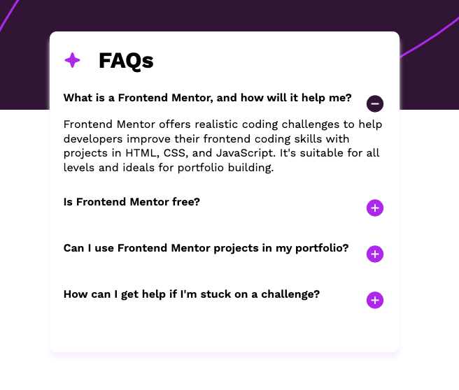

# Frontend Mentor - FAQ accordion solution

This is a solution to the [FAQ accordion challenge on Frontend Mentor](https://www.frontendmentor.io/challenges/faq-accordion-wyfFdeBwBz). Frontend Mentor challenges help you improve your coding skills by building realistic projects. 

## Table of contents

- [Overview](#overview)
  - [The challenge](#the-challenge)
  - [Screenshot](#screenshot)
  - [Links](#links)
- [My process](#my-process)
  - [Built with](#built-with)
  - [Continued development](#continued-development)
- [Author](#author)

## Overview

### The challenge

Users should be able to:

- Hide/Show the answer to a question when the question is clicked
- Navigate the questions and hide/show answers using keyboard navigation alone
- View the optimal layout for the interface depending on their device's screen size
- See hover and focus states for all interactive elements on the page

### Screenshot

### Links

- [Solution URL: ](https://github.com/MiyaoCat/frontend-mentor-challenges/tree/main/faq-accordion)
- [Live Site URL:](https://frontend-mentor-challenges-coral.vercel.app/faq-accordion/index.html)

### Built with

- Semantic HTML5 markup
- CSS custom properties
- Flexbox

### Continued development

Still need to improve and work on styling the accordion icons. 

## Author

- Website - [John Miyao](https://www.johnmiyao.com)
- Frontend Mentor - [@MiyaoCat](https://www.frontendmentor.io/profile/MiyaoCat)
- Twitter - [@miyaocodes](https://www.twitter.com/miyaocodes)
